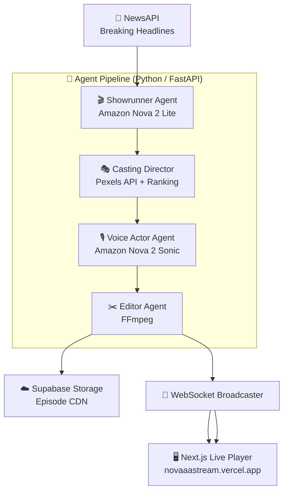

<div align="center">

# 🌌 NovaStream

### *The Infinite AI Broadcast — 24/7, No Humans Required*

[](./LICENSE)
[](https://www.python.org/)
[](https://nextjs.org/)
[](https://aws.amazon.com/bedrock/)
[](https://www.docker.com/)

<br/>

> **NovaStream** is a fully autonomous, AI-powered television network.  
> It continuously monitors the internet for breaking news, transforms headlines into  
> cinematic short-form video episodes — complete with scripted scenes, voiceover narration,  
> and matched stock footage — then broadcasts them live, 24/7, with zero human intervention.

<br/>

</div>

---

## ✨ What is NovaStream?

NovaStream is an end-to-end agentic media pipeline built on **Amazon Nova foundation models** via **AWS Bedrock**. Give it the internet, and it gives you a television channel.

Every few minutes, the system:

1. 📰 **Fetches** breaking news headlines from the live web
2. 🎬 **Produces** a fully scripted, multi-scene episode using *Amazon Nova 2 Lite*
3. 🎙️ **Voices** the narration scene-by-scene using *Amazon Nova 2 Sonic* (TTS)
4. 🎞️ **Casts** matching cinematic stock footage via the Pexels API
5. ✂️ **Edits** everything into a final broadcast-ready video with FFmpeg
6. 📡 **Broadcasts** the episode live to a web player over WebSockets

---

## 🤖 Amazon Nova — The Intelligence Behind NovaStream

NovaStream is purpose-built around **Amazon Nova**, AWS's latest generation of frontier foundation models. Nova models are invoked through **Amazon Bedrock** — AWS's fully managed AI platform — and power every creative and generative step of the pipeline.

| Nova Model | Model ID | Role in NovaStream |
|---|---|---|
| **Amazon Nova 2 Lite** | `us.amazon.nova-2-lite-v1:0` | The *Showrunner* — takes a raw news headline and produces a structured JSON production blueprint: scene count, scripts, visual themes, and narration copy |
| **Amazon Nova 2 Sonic** | `us.amazon.nova-2-sonic-v1:0` | The *Voice Actor* — performs hyper-realistic Text-to-Speech synthesis, narrating each scene with natural intonation and broadcast-quality audio |

**Why Amazon Nova?**
- **Speed** — Nova Lite delivers sub-second structured JSON generation, keeping the pipeline latency low enough for continuous broadcasting.
- **Quality** — Nova Sonic produces broadcast-quality voice output indistinguishable from a professional narrator.
- **Cost Efficiency** — Nova's competitive token pricing makes running a 24/7 autonomous pipeline economically viable.
- **Bedrock Integration** — Seamless `boto3` integration means no custom inference servers, no model hosting, and no ops overhead.

### AWS Services Used

```
AWS Bedrock  ──►  Amazon Nova 2 Lite   (Showrunner: script & scene generation)
             ──►  Amazon Nova 2 Sonic  (Voice Actor: TTS narration synthesis)
AWS IAM      ──►  Secure credential management via boto3 / STS
```

---

## 🏗️ Architecture



### Agent Breakdown

| Agent | File | Responsibility |
|---|---|---|
| **Showrunner** | `agents/showrunner.py` | Nova 2 Lite prompt → structured JSON episode blueprint |
| **Casting Director** | `agents/casting.py` | Query expansion + Pexels video search + quality ranking |
| **Voice Actor** | `agents/voice.py` | Nova 2 Sonic streaming TTS → per-scene `.mp3` audio |
| **Editor** | `agents/editor.py` | FFmpeg scene stitching → final `.mp4` broadcast episode |
| **Broadcaster** | `broadcaster.py` | WebSocket push of episode metadata + video URL to frontend |

---

## 💻 Tech Stack

| Layer | Technology |
|---|---|
| **AI Models** | Amazon Nova 2 Lite, Amazon Nova 2 Sonic (via AWS Bedrock) |
| **Backend** | Python 3.11, FastAPI, Asyncio, WebSockets |
| **Video Processing** | FFmpeg 6.0+ |
| **Frontend** | Next.js 14, React, Tailwind CSS |
| **Storage** | Supabase Storage |
| **External APIs** | NewsAPI, Pexels Video API |
| **Infrastructure** | Docker, docker-compose, Render |

---

## 🚀 Quick Start

### Prerequisites

- Python **3.11+**
- Node.js **20+**
- **FFmpeg 6.0+** — `brew install ffmpeg` (macOS) / `apt install ffmpeg` (Linux)
- **AWS credentials** with `us-east-1` Bedrock access (Nova 2 Lite + Nova 2 Sonic)
- **Supabase** project with a storage bucket
- **Pexels** API key
- **NewsAPI** key

### 1. Clone & Configure

```bash
git clone https://github.com/your-username/novastream.git
cd novastream
cp .env.example .env
```

Edit `.env` with your credentials:

```env
# AWS (Bedrock — Nova models)
AWS_ACCESS_KEY_ID=...
AWS_SECRET_ACCESS_KEY=...
AWS_DEFAULT_REGION=us-east-1

# Nova model IDs
NOVA_LITE_MODEL_ID=us.amazon.nova-2-lite-v1:0
NOVA_SONIC_MODEL_ID=us.amazon.nova-2-sonic-v1:0

# External APIs
NEWSAPI_KEY=...
PEXELS_API_KEY=...

# Supabase Storage
SUPABASE_URL=...
SUPABASE_SERVICE_ROLE_KEY=...
SUPABASE_BUCKET=...
```

> ⚠️ `.env` is gitignored — your AWS keys will never be accidentally committed.

### 2. Run with Docker *(Recommended)*

```bash
docker-compose up --build
```

### 3. Run Manually

**Backend:**
```bash
cd backend
python3 -m venv venv && source venv/bin/activate
pip install -r requirements.txt
python main.py
```

**Frontend** *(new terminal)*:
```bash
cd frontend
npm install
npm run dev
```

Open **[http://localhost:3000](http://localhost:3000)** — the infinite broadcast is live. 📺

---

## ⚙️ Configuration Reference

| Variable | Description | Default |
|---|---|---|
| `NOVA_MAX_SCENES_PER_EPISODE` | Cap scenes per episode (cost control) | `2` |
| `SHOWRUNNER_MAX_TOKENS` | Max tokens for Nova Lite generation | `500` |
| `SHOWRUNNER_TEMPERATURE` | Nova Lite creativity (0.0–1.0) | `0.4` |
| `SHOWRUNNER_MAX_RETRIES` | Retry attempts on Bedrock failure | `1` |

> **💡 Cost Tip:** Keep `NOVA_MAX_SCENES_PER_EPISODE=2` during development to minimize Bedrock token usage.

---

## 🏆 Hackathon

Built for the **Amazon Nova AI Hackathon — March 2026**.

- 🧠 **Agentic AI** — Fully autonomous multi-agent pipeline with no human checkpoints
- 🎙️ **Multimodal Generation** — Cross-model pipeline spanning text (Nova Lite), speech (Nova Sonic), and video (FFmpeg + Pexels)
- 📡 **Real-Time Streaming** — Live WebSocket broadcast of AI-generated television

---

## 📄 License

This project is licensed under the **MIT License** — see the [LICENSE](./LICENSE) file for details.

---

<div align="center">
  <sub>Built with ❤️ and Amazon Nova · Powered by AWS Bedrock</sub>
</div>
