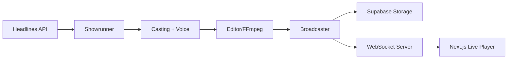

# 🌌 NovaStream 24/7 — The Infinite Broadcast

<p align="center">
  <b>Fully autonomous AI-powered television network.</b><br>
  Without any human intervention, NovaStream continuously monitors the internet for trending news headlines, transforms them into short-form video episodes with cinematic structure, voiceover narration, and music — then broadcasts them live via a web player.
</p>

---

## 🏗 Architecture

NovaStream operates using a multi-agent backend architecture tightly integrated with **AWS Bedrock** and **Supabase**, broadcasting directly to a visually stunning **Next.js** frontend via WebSockets.



### 🤖 The Agent Pipeline

| Agent | Role | AI Model / Tech |
|-------|------|-----------------|
| **Showrunner** | Generates production blueprint JSON from headline | Amazon Nova 2 Lite |
| **Casting Director** | Matches scenes to stock video via semantic matching | Nova Multimodal Embeddings |
| **Voice Actor** | Synthesizes voiceover narration per scene | Amazon Nova 2 Sonic |
| **Editor** | Stitches video + audio into final episode via FFmpeg | FFmpeg |

---

## ☁️ How AWS is Used in NovaStream

NovaStream relies heavily on **Amazon Web Services (AWS)** to power its core artificial intelligence logic. The entire agentic workflow is built around the **Amazon Bedrock** ecosystem to leverage the cutting-edge **Amazon Nova** foundation models.

Here is how AWS is utilized:

1. **Amazon Nova 2 Lite (`amazon.nova-2-lite-v1:0`)**:
   - Used by the **Showrunner Agent** to dynamically act as a TV producer. It takes a raw news headline and generates a structured, multi-scene production blueprint (JSON format) containing scripts, visual cues, and narrations.
2. **Amazon Nova Multimodal Embeddings (`amazon.nova-2-multimodal-embeddings-v1:0`)**:
   - Used by the **Casting Director Agent** to semantically map the Showrunner's visual descriptions to real-world stock footage from Pexels, ensuring highly relevant and context-aware B-roll video.
3. **Amazon Nova 2 Sonic (`amazon.nova-2-sonic-v1:0`)**:
   - Used by the **Voice Actor Agent** for hyper-realistic Text-to-Speech (TTS) synthesis. It breathes life into the Showrunner's script, voicing the news broadcast scene-by-scene.
4. **AWS Identity and Access Management (IAM)**:
   - For secure, scalable access, NovaStream connects to Bedrock using either short-term STS credentials or long-term IAM API credentials via `boto3`.

> **💡 Cost Savings & Local Fallbacks:**
> To ensure AWS Bedrock credits remain predictable during development, NovaStream features built-in **Low-Cost Modes**. You can cap the number of generated scenes per episode (`NOVA_MAX_SCENES_PER_EPISODE`) or disable heavy embedding calls (`USE_NOVA_EMBEDDINGS=false`).

---

## 💻 Tech Stack

- **Backend**: Python 3.11+, FastAPI, WebSockets, FFmpeg, Asyncio
- **Frontend**: Next.js 14, React, Tailwind CSS
- **AI / Cloud Services**: Amazon Bedrock (Nova family), Boto3
- **Storage**: Supabase Storage (Migrated from static S3)
- **External APIs**: Pexels Video API, NewsAPI
- **Deployment**: Docker, docker-compose

---

## 🚀 Quick Start

### Prerequisites
- Python 3.11+
- Node.js 20+
- **FFmpeg 6.0+** installed locally (`brew install ffmpeg`)
- **AWS API Keys** (with `us-east-1` Bedrock Nova access)
- **Supabase Service Key**
- **Pexels API Key**

### 1. Configuration
Clone the repository and configure your environment variables securely:
```bash
cp .env.example .env
# Edit .env with your specific AWS, Supabase, and Pexels keys.
```
*(Note: Your `.env` file is safely ignored by Git to prevent accidental AWS key leaks).*

### 2. Start the Backend
```bash
cd backend
python3 -m venv venv
source venv/bin/activate
pip install -r requirements.txt
python main.py
```

### 3. Start the Frontend Live Player
In a new terminal:
```bash
cd frontend
npm install
npm run dev
```

### 4. Docker (Alternative)
Run everything natively:
```bash
docker-compose up --build
```
Open [http://localhost:3000](http://localhost:3000) to view the live infinite broadcast!

---

## 🏆 Hackathon Categories
Built for the **Amazon Nova AI Hackathon — March 2026**.
- **Agentic AI**: Multi-agent orchestration with autonomous state transitions.
- **Multimodal Understanding**: Cross-model pipeline using Nova Lite text generation, Sonic TTS, and Embeddings for full A/V production.
